# NS4U APP 🎮

> **Play Switch games on your PC or phone in no time!**

NS4U is a powerful game management tool that brings your Switch gaming experience to PC and mobile devices. Built-in game library with tons of games ready to enjoy!

🌐 [Official Website](https://ns4u.fun) 📥 [Download](https://github.com/PhilipXing/NS4U/releases/tag/NS4U_APP)  

---

## ✨ Features

- 🎮 **Multi-Platform Support** - Windows, macOS, Android, and iOS
- 📚 **Built-in Game Library** - Access to a vast collection of games
- ⚡ **One-Click Installation Emulator** - Easy installation of Switch emulator
- 🔄 **Auto-Updates** - Always stay up to date with the latest version
- 🎯 **User-Friendly Interface** - Clean and intuitive design

## 🖼️ Screenshots

### Windows Platform
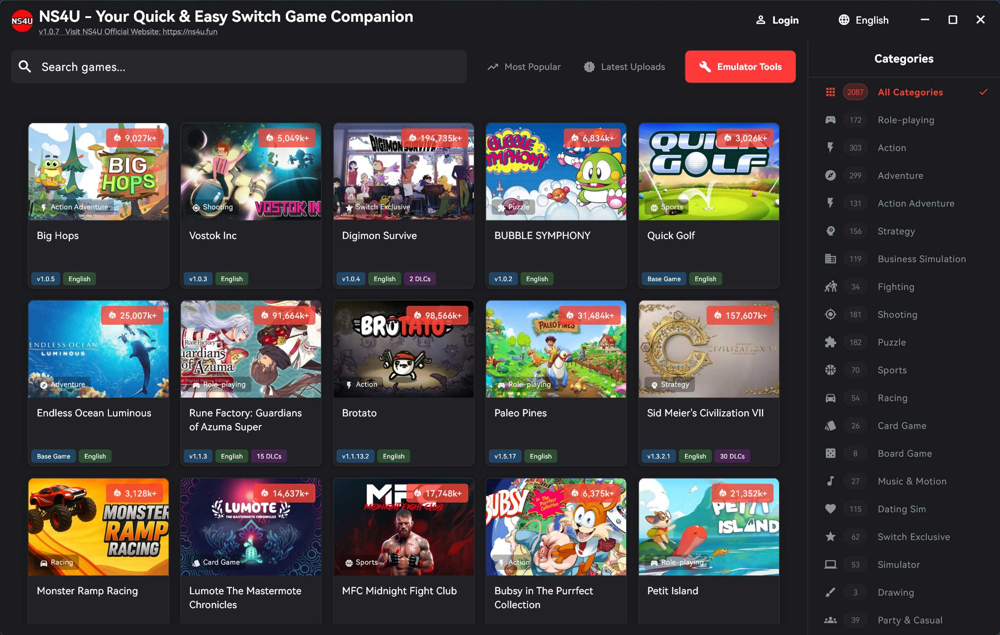

🪟 More screenshots

 

  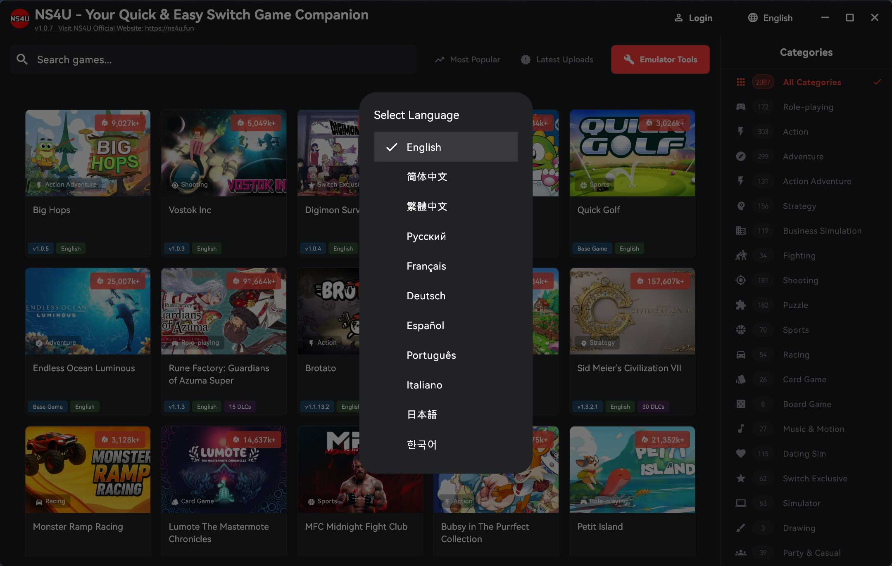

  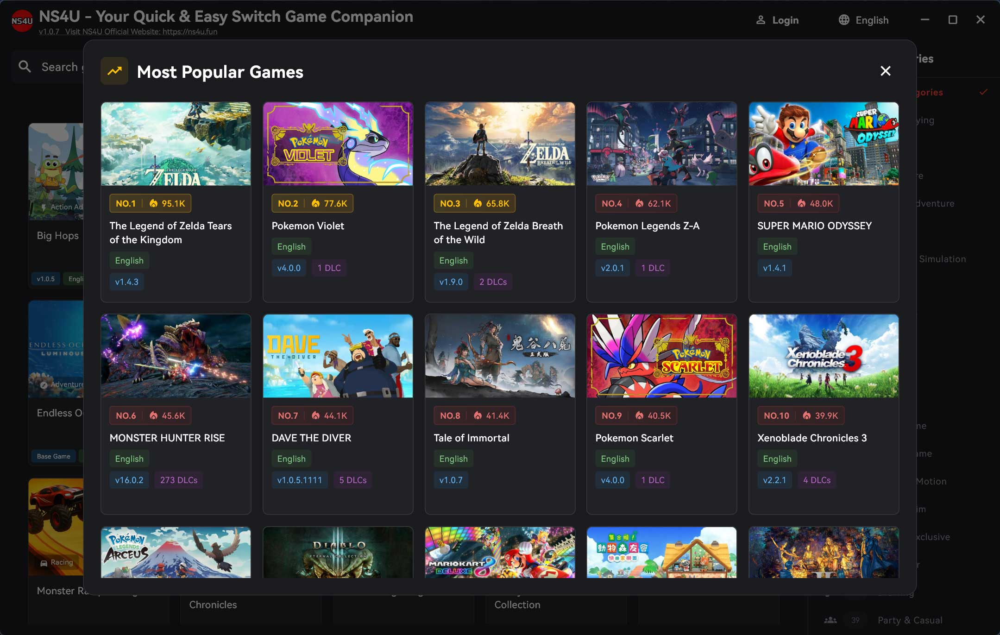

  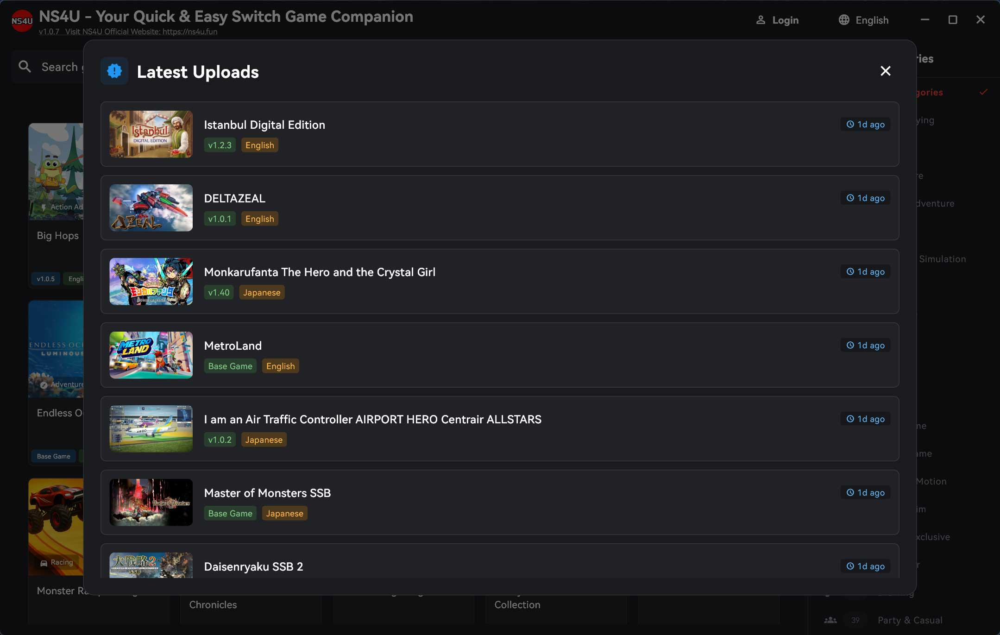

  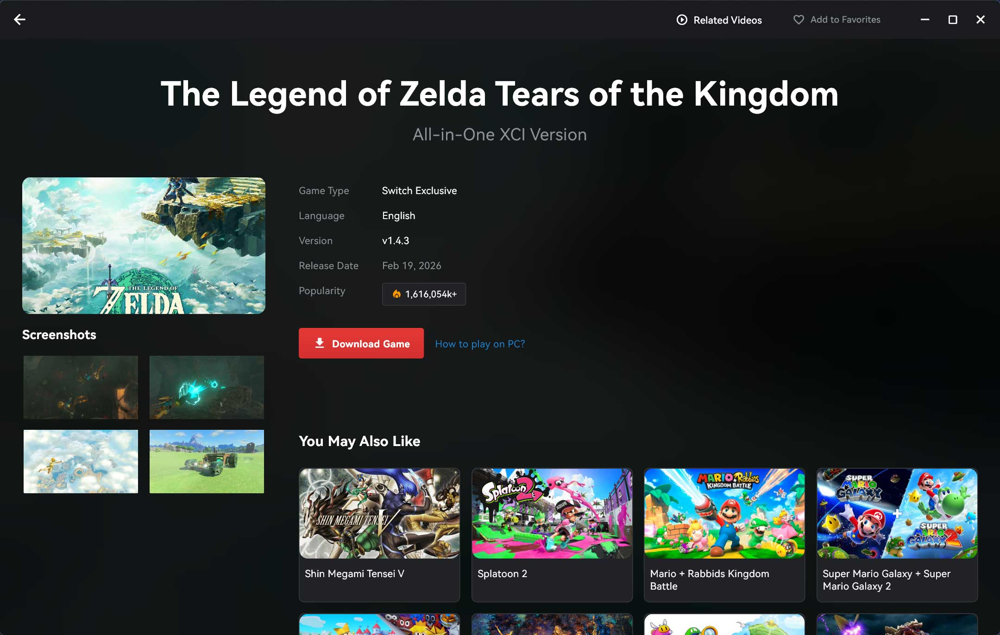

  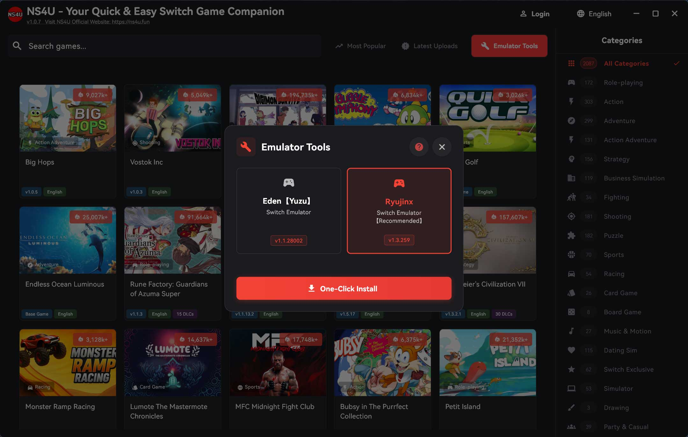

### Android Platform

  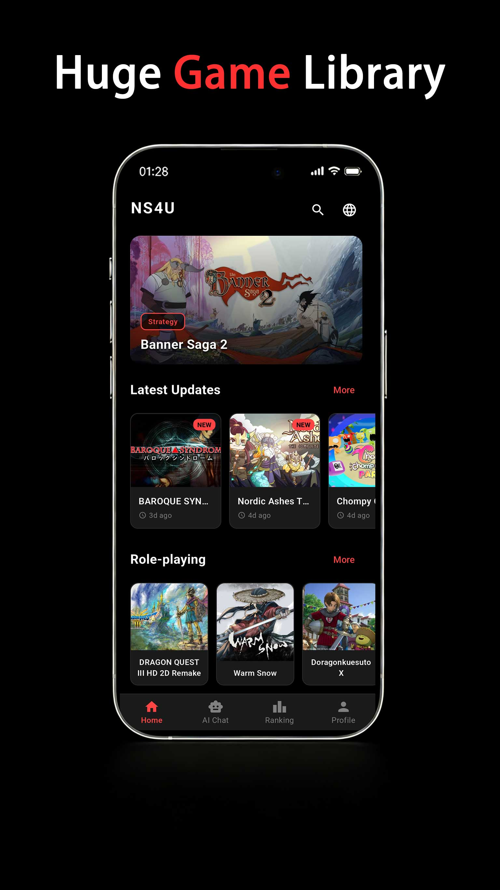
  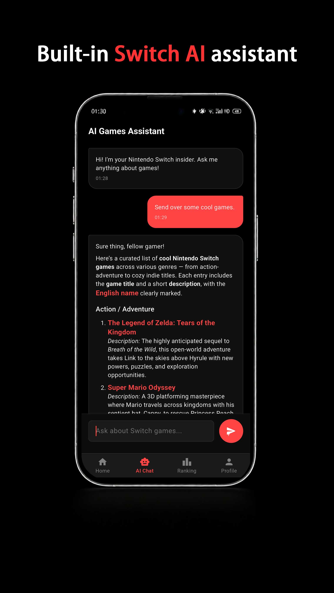
  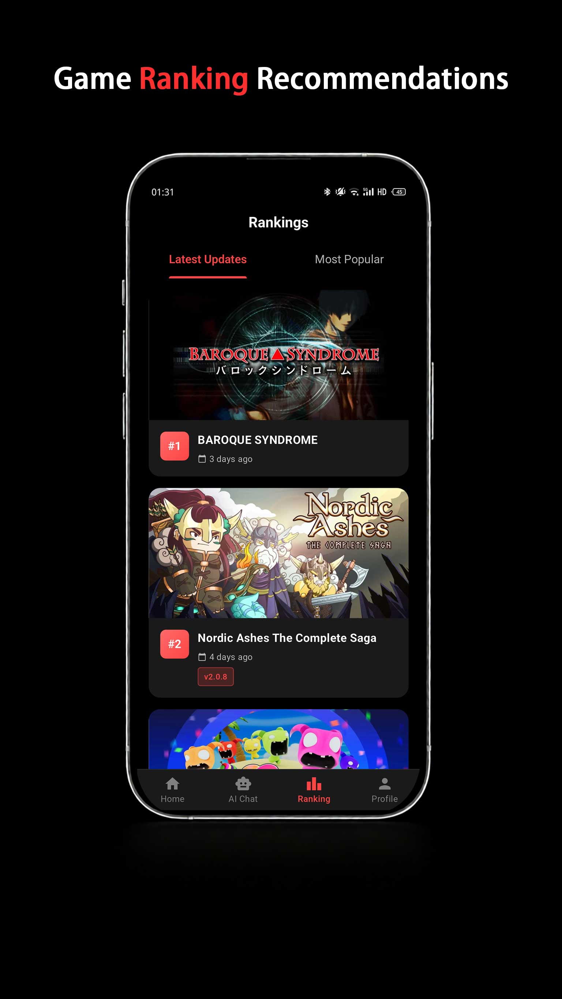

  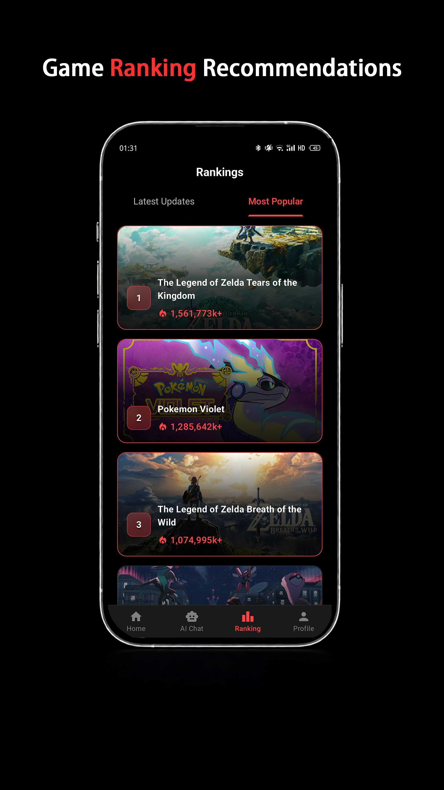
  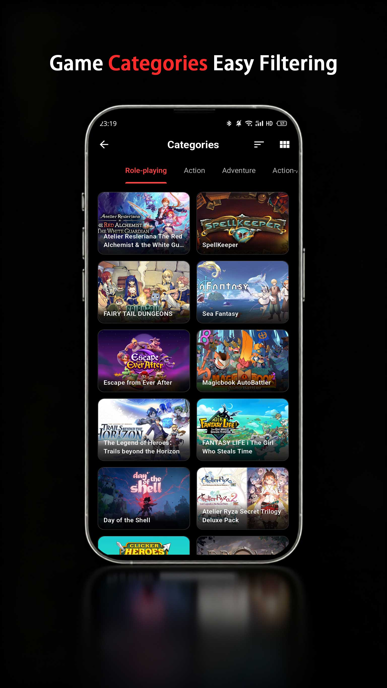
  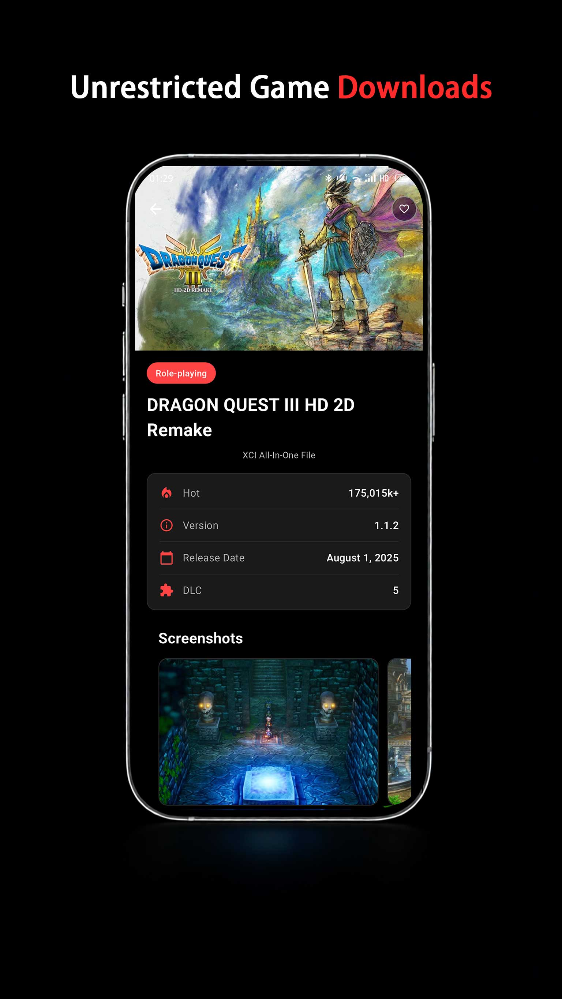
  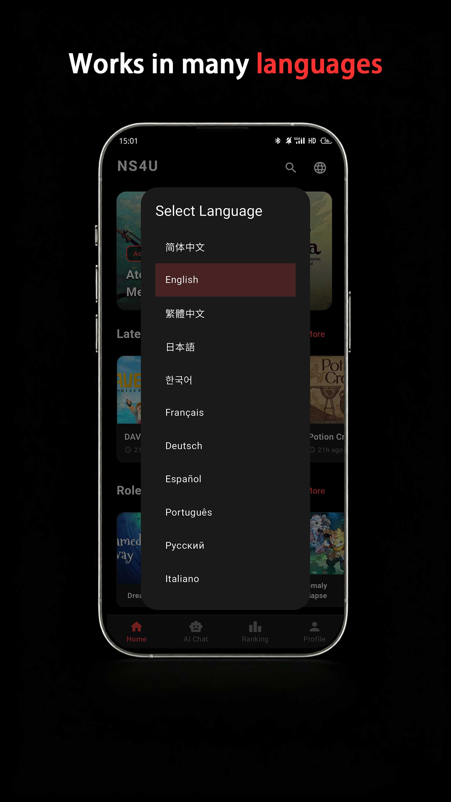

